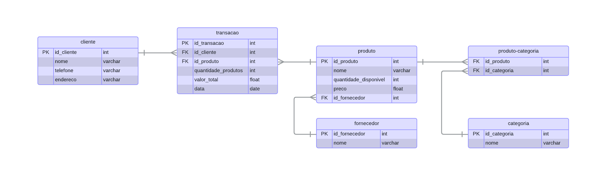

# Sistema de Mercado 🛒
Atividade WomakersCode de sistema de Mercado com banco de dados:

### Objetivos
- 💻 Assimilar comandos para conexão com um  banco de dados
- ⚙️ Criar estrutura de CRUD
- 🔗 Compreender modelos de bancos relacionais

### Modelo Entidade-Relacionamento

